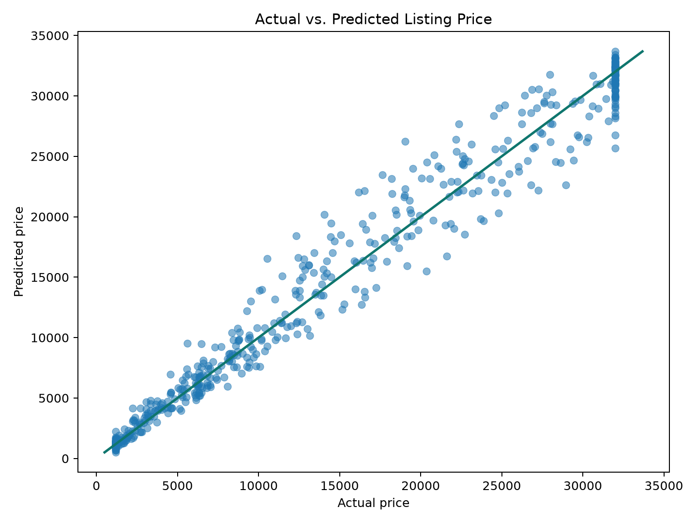
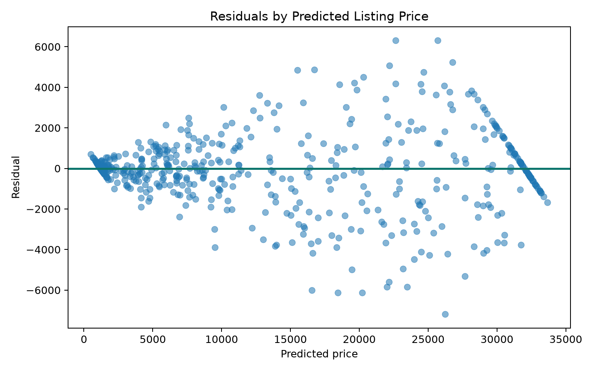
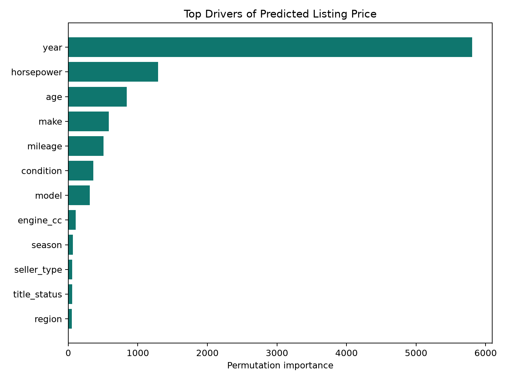
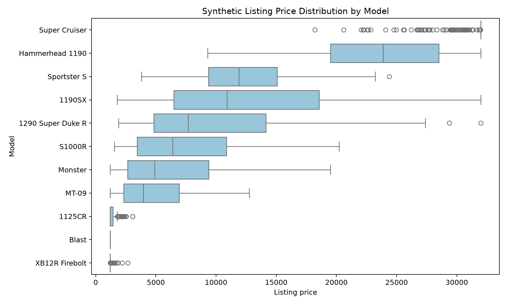

# Buell Market Value Predictor

## Executive Summary

This project builds an end-to-end machine learning workflow that estimates used
motorcycle listing prices and flags Buell listings that appear underpriced,
fairly priced, or overpriced.

The final model is a histogram gradient boosting regressor trained on 3,000
synthetic motorcycle marketplace records. The data is portfolio-safe and does
not use scraped listings, employer data, API keys, or confidential business
logic.

## Business Use Case

A buyer, enthusiast marketplace, or dealership analyst could use a tool like
this to:

- estimate a fair asking price for a used motorcycle listing
- identify potentially underpriced opportunities
- compare Buell models against similar performance motorcycles
- explain which listing attributes are driving predicted value

## Data

The generated dataset includes Buell models and comparable motorcycles. Features
include:

- make, model, segment, year, age, mileage, and condition
- horsepower, torque, engine size, weight, and power-to-weight ratio
- seller type, region, season, title status, and days on market
- listing quality signals such as photos, description score, modifications, and service records

See `docs/data_dictionary.md` for the full field list.

## Model Results

| Model | MAE | RMSE | R2 | MAPE |
| --- | ---: | ---: | ---: | ---: |
| Hist Gradient Boosting | 1030.90 | 1668.11 | 0.9775 | 0.1118 |
| Random Forest | 1115.78 | 1899.05 | 0.9709 | 0.1033 |
| Ridge Regression | 2459.76 | 3184.76 | 0.9182 | 0.8978 |

The histogram gradient boosting model produced the lowest test-set MAE and was
selected as the final model.

## Key Outputs

- Saved model: `models/best_price_model.joblib`
- Metrics: `reports/model_metrics.csv`
- Feature importance: `reports/feature_importance.csv`
- Top deal examples: `reports/top_deal_examples.csv`
- Demo app: `app.py`

## Visuals

## What This Demonstrates

- Building a complete machine learning pipeline from raw data to deployed-style artifact
- Translating a hobby/business domain into model-ready features
- Comparing baseline and nonlinear models
- Using interpretable metrics and feature importance
- Turning predictions into business-friendly deal labels

## Portfolio Description

Built a Buell-focused motorcycle market value model using synthetic marketplace
data, feature engineering, regression modeling, and a Streamlit decision app.
The model estimates fair listing prices and flags underpriced opportunities
using marketplace, performance, and listing-quality signals.
